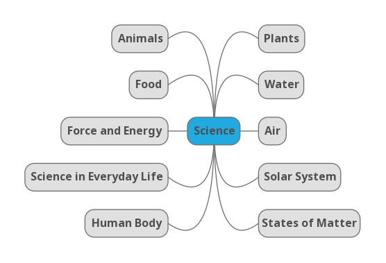

# Topics

Please use food-3.md as samples and create your own playlist.

The following types of activities can be created for each playlist.

- Passage
- Group
- Match
- MCQ
- Fill in the Blanks (By Drag Drop)
- Fill in the Blanks (using options)
- True or False
