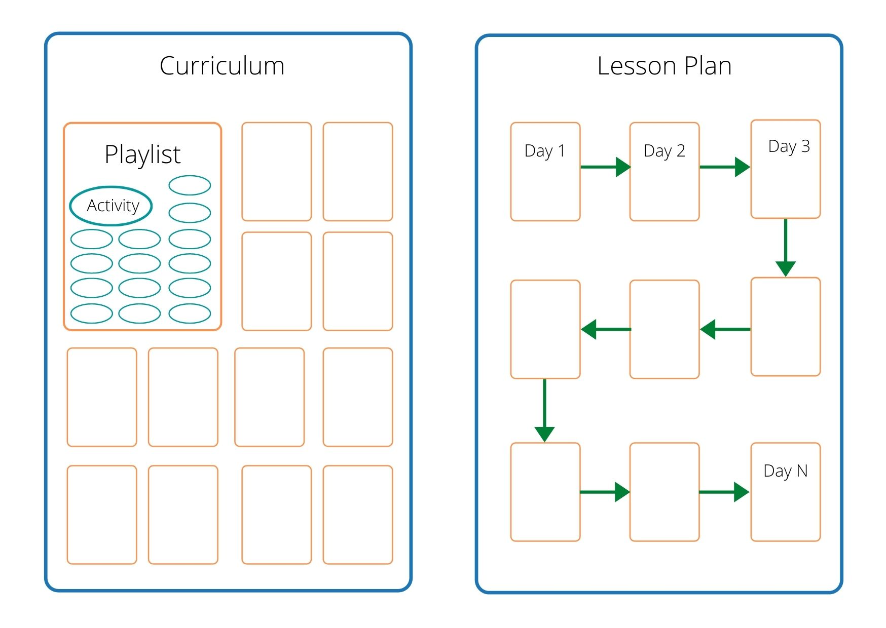

# Curriculum

Simply put, curriculum is a collection of playlist. It defines all the content for a particular context. And all content are arranged in logical playlists. For academics, we don't follow any particular syllabus. But the content developer should have complete knowledge about CBSE, ICSE and a couple of state board syllabi.

## Lesson Plan

This takes students from day 1 to N. We mix the content from
curriculum to break the monotony and keep the content interesting.

For example, we prepared 200 sentences for Articles. But we
don't want to present them all in one single day. We would give 40 sentences on
Day 4, another 40 on Day 20, another 40 on Day 38 and so on.

## Copy vs Reference

One of the major problems in IT based products is 'Duplicate'. When we have more
than one copy, we may not know which one is the latest. We update one file and
we are not aware of the existance on another file.

To avoid these confusions, we should avoid duplicates or copies of same files.
The real content will be present only in 'Curriculum'. The Content
Developers will work only on them. 'Lesson Plan' will be prepared later
by reference from curriculum. So if there is any change in curriculum, 
it will affect the Lesson Plan.

## Iterative content development

We don't freeze the content. We revisit the content at frequent interval and
make them better.

During each iteration our primary focus will be different.

- During the first iteration we try to create 'more content' in short duration.
- During the second iteration we try to clean up any issues and improve the
  quality.
- During the third iteration we try to make the content more interesting and try
  to integrate user feedback.
