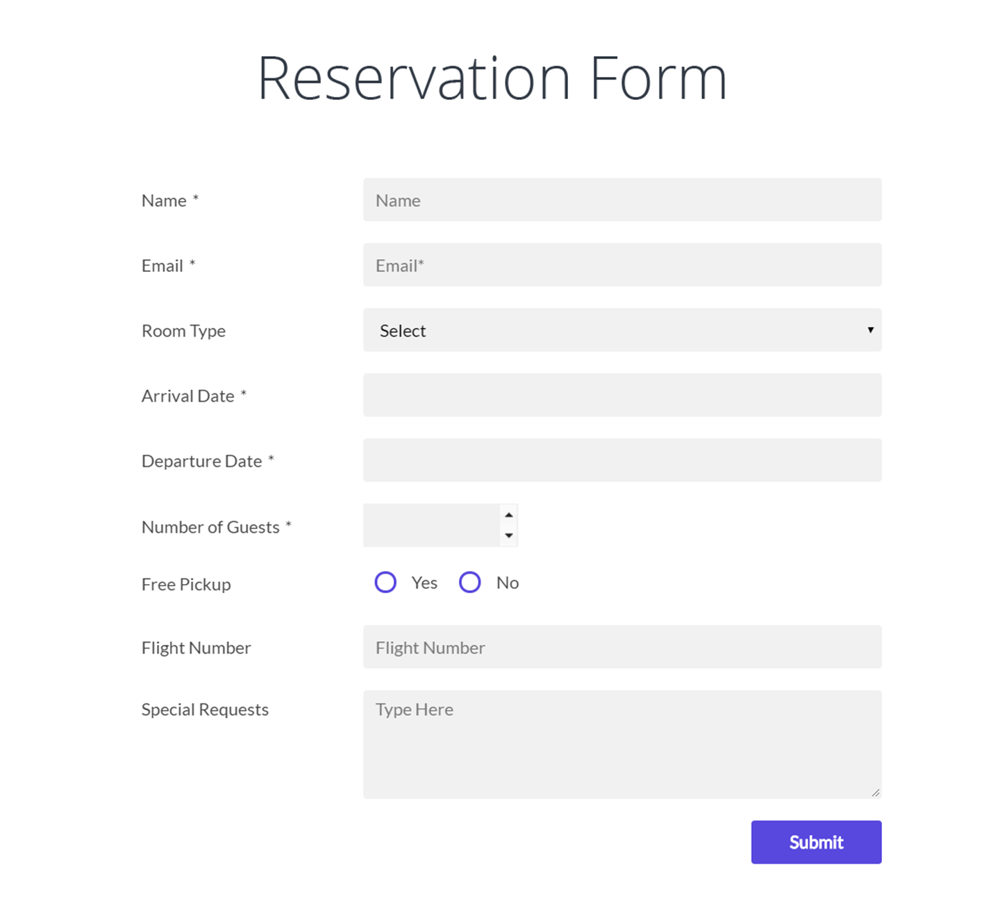
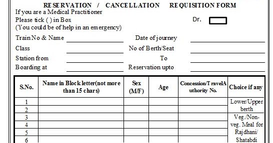

# Introduction

The core thing about Information Technology is data. JSON is a computer language
to represent data. It is easy to learn and understand JSON.

JSON stands for Javascript Object Notation.

There are two kinds of brackets we use.

1. angular bracket {} : It contains a collection of "name:value" pairs. It is
   used to group unreleated properties. Here "name" is also known as "property
   name". We usually wont have 'space' in name. eg. "no of sales" is written as
   "noOfSales" (camel case) or "no-of-sales".

2. square bracket []: It contains a list (array) of similar items.

Same data can be represented in different formats. For example if you want to
mention the number of sales for the last three years.

```
{
    data: [
        {
            "year": "2018",
            "sales": 130
        },
        {
            "year": "2019",
            "sales": 154
        },
        {
            "year": "2020",
            "sales": 172
        }
    ]
}
```

The above and below jsons represents the same data. The above is lengthy but
easily readable, but the below is short and not easily readable. There is a
hidden information that the nth item in 'sales' is related to the nth item in
'years'.

```
{
    years: ["2018", "2019", "2020"],
    sales: ["130", "154", "172"]
}
```

# Values Data type

1. String: It is the most common type. Always given within double quotes.
2. Number
3. Boolean: true/false
4. Array: [..,..,..,]
5. Object: {....}



For example when you fill a form, the data is sent from your computer to the
server in JSON format. The below is a JSON representation of the above form.

There are more than one ways to create a JSON.

```
{
    "name": "John",
    "email": "john@gmail.com",
    "roomType": "B",
    "arrivalDate": "3-3-2021",
    "departureDate": "5-3-2021",
    "noOfGuests": 3,
    "freePickup": false,
    ...
    ...
}

```



```

{
    "trainNo": "1001",
    "isDoctor": false,
    "stationFrom": "MAS",
    "stationTo": "SBC",
    ...
    "passangers": [
        {
            "name" : "John",
            "sex": "M",
            "age": "34",
            "concession":"-"
        },
        {
            "name" : "John",
            "sex": "M",
            "age": "34",
            "concession":"-"
        }
    ]
}

```

The above example is little complicated. Here we use an array of objects. And
this is very common in most of the practical applications. Even in pschool
playlist, activities are represented as an array of objects.

# Javascript Object

Javascript is the programming language used to build pschool.

We use Javascript object instead of JSON as it has some advantange.

| JSON                                             | JS Object                                                   |
| ------------------------------------------------ | ----------------------------------------------------------- |
| the keys should be within double quotes          | quotes on key is not needed                                 |
| the string values should be within double quotes | it can be single, or double or back tick (multiline string) |
| comments not allowed                             | comments allowed                                            |

# PSchool Playlist structure

{ id: 'playlist-id'

}
