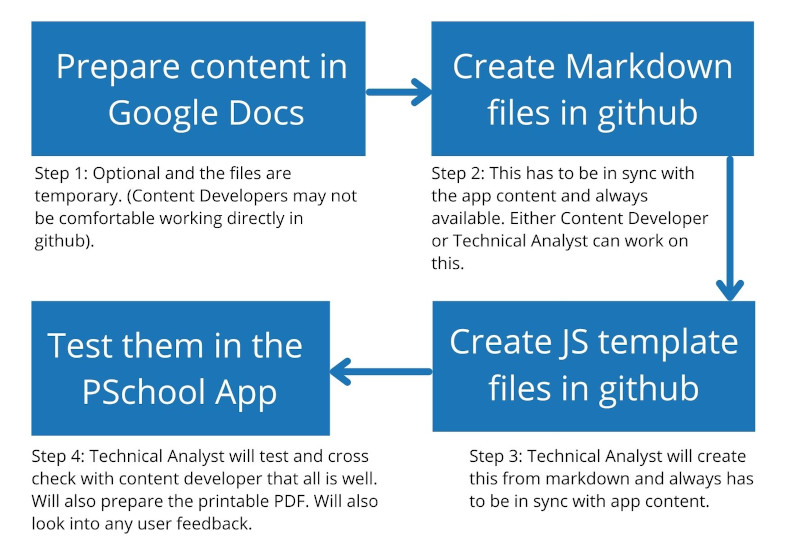

# Process

There are many ways in which an error or mistake can crop up. Having a process
and multiple review system only can ensure that our content are issue-free.

# Workflow

We wanted the best teachers to work with us. But we don't expect them to be tech
savy. We don't expect them to directly work in github. We want them to create
content in google docs or some other format.

The below image explains the work flow.

**Step 1:** Optional and the files are temporary. (Content Developers may not be
comfortable working directly in github).

**Step 2:** This has to be in sync with the app content and always available.
Either Content Developer or Technical Analyst can work on this.

**Step 3:** Technical Analyst will create this from markdown and always has to
be in sync with app content.

**Step 4:** Technical Analyst will test and cross check with content developer
that all is well. Will also prepare the printable PDF. Will also look into any
user feedback.
