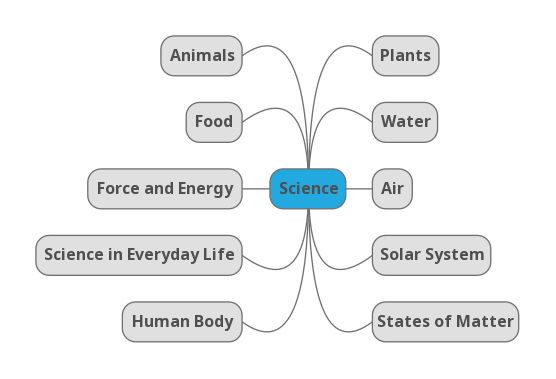

# Topics



Please use food-3.md as samples and create your own playlist.

The following types of activities can be created for each playlist.

- Passage
- Group
- Match
- MCQ
- Fill in the Blanks (By Drag Drop)
- Fill in the Blanks (using options)
- True or False

The birds eye view on science topics

[water](water) water-3

Water in general - potable water - conserving water - water-borne diseases - how
a simple pump works?

water cycle - three states of water - rainwater harvesting

storing and fetching water - old and new methods

```
kids-science, seasons

environment
plants
animals
humanbody & diseases
food & nutirents
everyday science

air
light and sound
solarsytem & space
matter
energy
communication and computer
```
